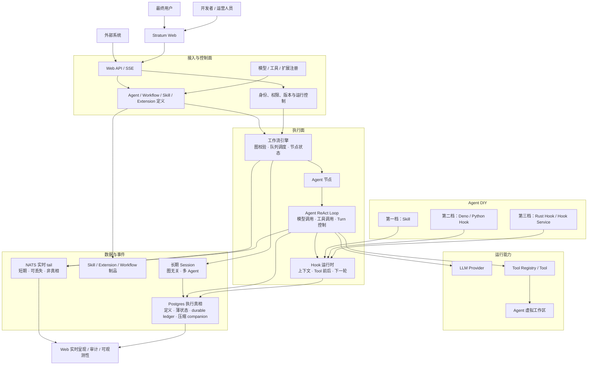

# Stratum 技术架构

> 文档状态：架构总览草案

## 总体架构



## 架构说明

### 1. Web 接入与控制面

`stratum-web` 和 `stratum-api` 对外提供对话、工作流编辑、运行控制、审批、历史查询和 SSE 事件流。

控制面管理 Session 以及 Agent、Workflow、Skill 和 Extension 的定义与发布版本，并负责身份、权限、Secret 引用和能力注册。Agent 可以在没有活跃操作时修改当前模型及其 LLM 参数；新 Turn 接受后会把该 `ModelConfig` 保存为 Agent 后续默认值。一个 Turn 开始后，其 Agent、Skill 集、Extension 集、Hook Handler 顺序、模型配置和工具集指纹保持不变，恢复也必须使用原 Turn 固定的配置。

Web/API 只负责接入和组合，不实现工作流调度与 Agent 循环。

### 2. 工作流引擎

工作流引擎负责节点级编排：

- 编译和校验工作流图；
- 维护变量池与节点依赖；
- 使用有界队列调度就绪节点；
- 持久化 Workflow 与节点状态；
- 支持暂停、恢复、取消和人工输入；
- 发布 Workflow 与节点事件。

Agent 可以作为工作流中的一种节点，也可以直接在 Session 中运行。直接对话不是隐式工作流：Session 是长期、共享且与图结构无关的核心资产，Workflow 图及其版本可以变化，Session 身份保持不变。Agent 作为节点运行时使用 `AgentLocation::WorkflowNode` 保留 Workflow version 与 node 身份；直接运行时使用 `AgentLocation::Direct`。

当前只在 Agent runtime 边界内保证同一 Session 最多有一个 running Agent；这不协调 Workflow 或其他未来的调度 owner。跨 runtime 并发、ownership 与 fencing 由后续 scheduler 模块设计，在此之前不增加 attempt 或 node-execution 身份。

### 3. Agent ReAct Loop 与 Hook

Agent 内核只负责稳定的执行机制：

```text
构造模型请求
→ 消费模型响应
→ 提交 Assistant 消息
→ 执行 Tool Call
→ 提交 Tool Result
→ 继续或结束 Turn
```

策略通过五个核心 Hook 进入循环：

- `transform_context`
- `transform_tool_call`
- `decide_tool_call`
- `after_tool_call`
- `prepare_next_turn`

多个 Hook Handler 按固定版本和顺序执行。会影响 Resume 的参数修改、阻断、结果变换和下一轮决策以 journal 事件变体住在 Postgres durable ledger 内部（没有第二个耐久边界），恢复时按语义 invocation identity 复用。journal 与 NATS 观察流分离。

Hook、Registry、Event 和 Port 不混用：Hook 修改当前流程，Registry 注册能力，`DurableAgentEvent` 记录正确性事实与 resume 真相，`AgentTelemetryEvent` 只用于观察，Port 用于替换外部实现。

### 4. 三档 Agent DIY

| 档位 | 用户提供的内容 | 运行方式 |
|---|---|---|
| 第一档 | Skill 指令和资源 | 通用 Agent 在上下文构造阶段加载 |
| 第二档 | Deno 或 Python Hook | 独立 Extension Host 进程执行 |
| 第三档 | Rust Hook | 受信任的链接式 Hook 或独立 Hook Service |

三档能力共享不可变版本、权限、审计和 Turn runtime snapshot 固定机制。Skill 不执行任意代码；Deno/Python 默认与 Agent 进程隔离；Rust 动态共享库不作为通用扩展机制。

### 5. 文件系统与存储

文件与存储分成三个逻辑域：

| 数据域 | Agent 是否可见 | 主要约束 |
|---|---:|---|
| Agent 工作区 | 是，通过 `VirtualPath` | 沙箱、权限、容量和路径安全 |
| 运行时持久化 | 否 | Postgres 四表 durable ledger、事务一致性、幂等和恢复 |
| 制品存储 | 否 | 不可变版本、内容摘要和分发 |

本地开发时，Agent 工作区与制品可以使用同一物理文件系统，但接口、命名空间和 ACL 保持隔离；运行时执行事实即使在本地也只写入 Postgres。NATS 只提供短期、可丢失的实时 tail，永远不是运行状态、Agent 历史或 Hook 决策的持久化存储。

### 6. Postgres 执行存储（唯一执行真相）

执行持久化收敛为 concrete `stratum-postgres` 拥有四张表，无 projection 表：

- `agents`：immutable Agent identity 与创建时固化的 resolved definition snapshot（prompt、按序 tools、creation-time effective model）。
- `agent_state`：薄状态——durable status、绑定的 Session/current Turn、mutable default model 与 `last_event_seq` high-water；不复制 outcome、usage、snapshot、approval 或 hosting。
- `durable_events`：append-only ledger；agent-wide、无空洞的 `event_seq` 是唯一 durable 顺序，由 `agent_state` 行锁（`FOR UPDATE`）在集中 append 事务中分配并串行化同 Agent writer。
- `transcript_compactions`：与 `TranscriptCompacted` discriminator 同事务写入的 companion，只保存单一 typed summary、`upto`、`compacted_iteration` 与 `retained_from_event_seq` 保留指针；原始 durable messages 永久保留。

其他不变量：

- hosting 是进程内 exact `(AgentId, TurnId)` registry 的易失观察，永不持久化；进程重启后 registry 为空，恢复靠显式 resume。
- 持久化顺序固定为 Postgres commit 先于 NATS publish；NATS 只是 Agent-scoped 的短实时 tail，发布丢失由 PG snapshot/history 收敛。
- AgentLoop kernel（`stratum-agent`）只见 scope-free typed durable events 与 `DurableEventSink` / `TelemetryEventSink` 合同；Postgres、HTTP、Session、hosting、scheduler 与分页永不进入 AgentLoop。`stratum-core` 只提供共享领域身份和上下文类型，Postgres 编排全部放在装配层 `stratum-api`。

### 7. 可观测性与安全

当前统一运行层级为：

```text
Session → 可选 Workflow Node → Agent Turn → LLM / Tool / Hook
```

每层使用结构化 tracing、metrics 和类型化事件。默认不记录 Prompt、Tool 参数、Tool Result、Secret 或主机路径。

所有定义、制品、Session 和扩展服务带有租户与项目作用域；不受信任的 Script Hook 运行在受限进程或容器中，并限制网络、文件、时间、内存和输出。

## 代码模块映射

| 架构职责 | 模块 |
|---|---|
| 公共身份与事件类型 | `stratum-core` |
| Agent ReAct Loop | `stratum-agent` |
| Tool | `stratum-tools` |
| LLM Provider | `stratum-llm` |
| Agent 虚拟工作区 | `stratum-filesystem` |
| Postgres 执行存储 | `stratum-postgres` |
| 实时 tail 与 kernel sink 合同 | `stratum-infra` |
| HTTP API 与运行时组合 | `stratum-api` |
| Web 产品 | `stratum-web` |
| 工作流引擎 | `stratum-workflow` 逻辑模块 |
| Hook 运行时 | `stratum-hook` 逻辑模块 |
| Deno/Python 扩展宿主 | `stratum-extension-host` 逻辑模块 |

逻辑模块不要求与 Cargo crate 一一对应；只有形成独立职责和依赖边界时才拆分 crate。
