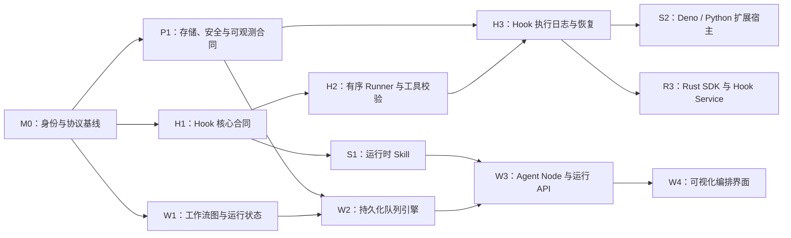

# Stratum 开发路线图

> 文档状态：讨论草案
>
> 架构总览：[`ARCH.md`](ARCH.md)

本文只记录开发节奏、依赖关系、验收条件和延后事项。总体技术架构见 [`ARCH.md`](ARCH.md)。

## 1. 执行原则

- 每个阶段先冻结依赖它的公共合同，再进入实现。
- 优先交付可运行、可持久化、可恢复的纵向切片。
- 公共协议必须覆盖兼容性、非法输入和错误脱敏测试。
- 涉及持久化的能力必须在同一阶段提供进程重启与 Resume 测试。
- 涉及代码执行、网络、文件或 Secret 的能力必须同时完成安全边界。
- 每项实现使用独立 worktree 和非 `main` 分支。
- PR 合入前，将最终实现约定归档到相关 crate 的 `AGENTS.md`。

## 2. 总体依赖

M0 完成后，Agent DIY、Workflow 和平台基础三条线可以并行。语言运行时和远程 Hook Service 必须等待 H3。

## 3. 开发节奏

| 工作线 | 主要内容 | 启动条件 |
|---|---|---|
| A：Agent DIY | Hook、Skill、脚本扩展、Rust SDK | M0 完成 |
| B：Workflow | 图模型、调度器、节点、工作流 API | M0 完成 |
| C：平台基础 | 存储、安全、可观测性、运维 | M0 期间即可启动 |

每个迭代结束时完成：

1. 运行受影响 crate 的单元、集成、异常输入和恢复测试；
2. 通过公共 API 演示一个端到端场景；
3. 检查持久化记录、事件、日志和错误是否泄露敏感信息；
4. 将已经确认的架构决策同步到对应详细设计；
5. 更新相关 crate 的 `AGENTS.md`。

## 4. M0：身份与协议基线

**目标：** 在新增公共 API 和持久化格式前统一运行身份与版本模型。

- [ ] 确认 `RunId` 表示顶层 Workflow Run。
- [ ] 确认直接对话使用隐式单 Agent Workflow。
- [ ] 定义 Agent 接收外部运行上下文的接口。
- [ ] 定义 `NodeExecutionId` 和 `HookInvocationId` 的作用域。
- [ ] 定义 Agent、Workflow、SkillSet 和 ExtensionSet 的不可变版本身份。
- [ ] 统一 `docs/PROTOCOL.md` 与当前 `StreamEnvelope`、`RuntimeEvent`、`AgentEvent`、`business_seq` 和 `EventCursor`。
- [ ] 确认 Hook 执行日志与 `AgentStore` 的组合边界。
- [ ] 完成 Skill、Script Extension、Rust Hook 和 Hook Service 的基础威胁模型。

**验收条件：**

- [ ] 身份、版本固定、Hook 错误和 Resume 语义形成已接受的设计记录。
- [ ] Workflow 和 Hook 不依赖旧协议中的冲突语义。
- [ ] 现有 Agent API 与历史数据的迁移影响清晰。

## 5. 工作线 A：Agent DIY

### H1：四个核心 Hook 合同

**依赖：** M0。

- [ ] 定义 `transform_context` 输入与决策。
- [ ] 定义 `before_tool_call` 的继续、修改和阻断决策。
- [ ] 定义 `after_tool_call` 的结果替换决策。
- [ ] 定义 `prepare_next_turn` 的继续、停止和注入消息决策。
- [ ] 提供无处理器时保持现有行为的 No-op Runtime。
- [ ] 通过 `AgentBuilder` 注入单一 Hook Runtime。
- [ ] 将取消和 Deadline 传入每次 Hook 调用。
- [ ] 保持 Hook 决策与 EventBus 观察路径分离。

**验收条件：**

- [ ] No-op Runtime 下现有 Agent 测试行为不变。
- [ ] 四个 Hook 均有正常、错误、超时和取消测试。
- [ ] Block 不执行 Tool，并生成模型可见的类型化结果。

### H2：有序执行器、工具校验与审批

**依赖：** H1。

- [ ] 在 `stratum-tools` 建立统一参数校验边界。
- [ ] Hook 前校验模型生成的原始参数。
- [ ] 完整 Hook Chain 后重新校验最终参数。
- [ ] 固化 ExtensionSet 中的处理器顺序。
- [ ] 实现顺序变换、Block 短路和 Stop 短路。
- [ ] 决策型 Hook 失败时关闭当前操作并返回类型化错误。
- [ ] 将内置授权与用户审批放在最终参数校验之后。
- [ ] 保持本阶段 Tool Call 顺序执行。

**验收条件：**

- [ ] 重启前后处理器顺序一致。
- [ ] 审批界面展示的参数与实际执行参数一致。
- [ ] Hook 修改后的非法参数不会进入审批或 Tool 执行。

### H3：Hook 执行日志与恢复

**依赖：** H2、P1。

- [ ] 在 Run 快照中固定 ExtensionSet 与处理器版本。
- [ ] 持久化 Hook Invocation 身份、输入摘要、结果和终态。
- [ ] Resume 时复用匹配的既有结果。
- [ ] 身份、版本或输入摘要不匹配时 Fail Closed。
- [ ] Tool 执行前持久化最终参数或 Block 决策。
- [ ] Tool Message 提交前持久化 `after_tool_call` 结果。
- [ ] 迭代推进前持久化 Stop/Inject 决策。
- [ ] 将 `HookInvocationId` 作为远程调用幂等键。
- [ ] 定义记录大小、保留期和清理策略。

**验收条件：**

- [ ] 在每个 Hook 持久化边界注入进程崩溃后都能正确恢复。
- [ ] 恢复过程不会重复应用已提交的 Hook 决策。
- [ ] 运行中的 Extension 版本变化不会影响已固定的 Run。

### S1：第一档运行时 Skill

**依赖：** H1 的 `transform_context`、M0 的制品版本模型。

**可并行：** H2、H3。

- [ ] 定义 Skill 元数据、`SKILL.md`、可选资源和能力声明。
- [ ] 定义 `SkillId`、不可变版本或内容摘要、SkillSet 加载顺序。
- [ ] 发布时校验路径、大小、编码、重复 ID 和元数据。
- [ ] 在 Agent/Run 定义中固定 SkillSet。
- [ ] 为通用 Agent 提供受信任的 Skill 上下文处理器。
- [ ] Skill 只能使用已授权 Tool，不能自行扩权。
- [ ] API 和 Web 支持发布 Skill 并挂载到通用 Agent。

**纵向切片：**

- [ ] 发布 Skill → 挂载通用 Agent → 执行 Turn → 重启 → Resume，并确认 Skill 版本不变。

### S2：第二档 Deno/Python 扩展宿主

**依赖：** H3、扩展宿主威胁模型。

- [ ] 定义一套语言无关的版本化 Hook Wire Protocol。
- [ ] 默认在 Agent 进程外运行 Extension Host。
- [ ] 加载前校验制品摘要和协议兼容性。
- [ ] 限制运行时间、内存、输出、文件和网络权限。
- [ ] 贯穿取消、Deadline、健康检查和有界并发。
- [ ] 建立语言无关的一致性测试套件。
- [ ] 按首个真实使用场景选择 Deno 或 Python 作为第一适配器。
- [ ] 第二适配器复用同一协议和测试套件。
- [ ] 区分受信任本地模式与隔离生产模式。

### R3：第三档 Rust SDK 与 Hook 服务

**依赖：** H3；公共协议已被至少一个 Script Adapter 验证。

- [ ] 定义不暴露 Agent 内部类型的公共 Rust SDK。
- [ ] 支持在应用组合根注册链接式受信任 Hook。
- [ ] 提供基于同一协议的 Hook Service Server Helper。
- [ ] 定义服务身份、版本、Endpoint、能力、作用域和健康状态。
- [ ] 在 Run 启动时固定解析后的服务版本与 Endpoint 集合。
- [ ] 使用认证传输和租户/项目级授权。
- [ ] 提供 SDK 合同测试与参考 Hook Service。

## 6. 工作线 B：Workflow 编排

### W1：图模型、编译器与运行状态

**依赖：** M0。

- [ ] 定义版本化 `WorkflowDefinition` 与不可变 `ExecutionPlan`。
- [ ] 定义节点输入、输出、边和变量引用。
- [ ] 校验起止节点、可达性、重复 ID、缺失引用、端口兼容和非法环。
- [ ] 定义 Run、Node、Attempt 和 Wait 状态。
- [ ] 定义变量池的类型与大小限制。
- [ ] 定义原子状态转换与持久化错误格式。
- [ ] 为图解析、校验和调度不变量添加 Property Test。

**首批节点：**

- [ ] Start
- [ ] End/Answer
- [ ] Agent
- [ ] Tool
- [ ] Condition
- [ ] 简单数据变换

### W2：持久化队列引擎

**依赖：** W1、P1。

- [ ] 从持久化依赖状态构建有界 Ready Queue。
- [ ] 使用 `JoinSet` 管理有界并发节点。
- [ ] 下游节点入队前原子提交节点输出和终态。
- [ ] 由 Run Coordinator 分配确定的状态与事件顺序。
- [ ] 重启后从持久化状态重建 Ready Queue。
- [ ] 实现持久化暂停、恢复和取消命令。
- [ ] 增加 Run/Node Deadline 与最大执行步数。
- [ ] 在幂等与 Attempt 身份明确后再加入 Retry。

**验收条件：**

- [ ] 线性图、条件分支和有界并行分支均支持重启恢复。
- [ ] 排队中和执行中的节点均可取消。
- [ ] 重复命令保持幂等。
- [ ] 损坏的 Graph/Run 状态 Fail Closed。

### W3：Agent 节点、事件与运行 API

**依赖：** W2、S1。

- [ ] Workflow Runtime 创建并拥有 `RunId`。
- [ ] 将 Run/Node Scope 传入 Agent Runtime。
- [ ] 将工作流变量适配为 Agent Turn 输入。
- [ ] 将 Agent 输出投影到变量池。
- [ ] 在 Workflow Run 下保留 Agent/LLM/Tool 事件身份。
- [ ] 提供 Workflow 创建、发布、运行、查询、取消和恢复 API。
- [ ] 提供 Run 事件重放与持久化历史读取。
- [ ] 将直接对话迁移到隐式单 Agent Workflow 路径。

**纵向切片：**

- [ ] Start → 带 Skill 的 Agent → Condition → End，覆盖 SSE、取消、重启和 Resume。

### W4：可视化编排界面

**依赖：** W1 的稳定图 Schema 与 API。

**可并行：** W2、W3。

- [ ] 使用版本化 Fixture 构建 Workflow Editor。
- [ ] 前后端同时校验连线与端口类型。
- [ ] 区分可编辑草稿与不可变发布版本。
- [ ] 展示节点运行状态和渐进式执行详情。
- [ ] 提供测试运行输入与结果视图。
- [ ] 仅在后端具备持久化语义后开放暂停、取消和恢复控制。

## 7. 工作线 C：平台基础

### P1：存储合同

- [ ] 分离 Agent 工作区、运行状态和不可变制品的逻辑接口。
- [ ] 定义生产环境跨进程 CAS 要求。
- [ ] 定义租户/项目分区与授权边界。
- [ ] 区分需要关系查询的记录与 Blob/Object 制品。
- [ ] 定义事件、历史、Hook 执行日志和制品的保留策略。
- [ ] 为不确定写入、重试和故障恢复提供注入测试。

### P2：安全与治理

- [ ] 在接入层加入认证与租户/项目身份。
- [ ] 定义作者、发布者、执行者、审批者、查看者和管理员权限。
- [ ] 定义 Secret 引用与执行时解析。
- [ ] 定义制品摘要、签名和来源记录。
- [ ] 定义 Extension 能力声明与执行策略。
- [ ] 审计网络、文件、Tool、模型和 Secret 访问。
- [ ] 在工作流等待跨进程前实现持久化审批。
- [ ] 加入速率、并发、CPU、内存、时长和输出配额。

### P3：可观测性

- [ ] 固化 Run → Node → Agent Turn → LLM/Tool/Hook 的 Span 层级。
- [ ] 记录 Hook 延迟、错误、超时、Block 和日志命中指标。
- [ ] 记录队列深度、就绪等待、节点耗时、恢复和 Retry 指标。
- [ ] 记录模型用量与 Tool 结果分类，不记录敏感载荷。
- [ ] 为发布、注册、审批和高权限执行提供审计记录。
- [ ] 在应用组合根接入 OpenTelemetry Exporter。

### P4：可靠性与运维

- [ ] 为 API、Scheduler、EventBus、Store 和 Extension Worker 提供健康检查。
- [ ] 为排队节点、运行节点和 Hook Invocation 实现优雅关闭。
- [ ] 验证定义、状态、执行日志和制品的备份恢复。
- [ ] 在首个生产持久化格式变更前建立数据迁移机制。
- [ ] 在所有持久化边界增加进程终止故障测试。
- [ ] 校验部署中的协议和 SDK 版本兼容性。

## 8. 并行与串行关系

### 可以并行

- H1 与 W1：M0 完成后分别推进。
- S1 与 H2/H3：`transform_context` 合同冻结后推进。
- P1/P2 与 Hook、Workflow 合同设计同步推进。
- W4 与 W2/W3：图 Schema 冻结后使用 Fixture 开发。
- Deno 与 Python Adapter：共享协议和一致性测试冻结后并行。
- 各工作线的可观测性：身份和 Span 命名冻结后同步接入。

### 必须串行

- Tool 参数修改 → 最终校验 → 用户审批 → Tool 执行。
- Hook Journal 与版本固定完成后，才能接入 Script/Rust 远程执行。
- `RunId` 作用域确定后，才能固化 Workflow 持久化协议。
- 节点状态可持久化后，才能实现 Queue Resume。
- `NodeExecutionId` 和幂等语义明确后，才能加入 Loop 与 Retry。
- 隔离和能力模型通过评审后，才能执行不受信任的 Script Extension。

## 9. 延后事项

- Rust 动态共享库加载；
- 运行中的 Skill 或 Extension 热替换；
- Extension Marketplace 与自动远程安装；
- Command、Renderer、Shortcut 和任意 UI Plugin Registry；
- 并发 Tool 执行；
- 运行期间动态修改共享 Tool Registry；
- 模型主动安装 Skill；
- W2 验证前的 Loop、Iteration 和 Subgraph；
- 多地域 Workflow 迁移；
- 未出现真实调用方前的通用远程文件系统和挂载路由。
