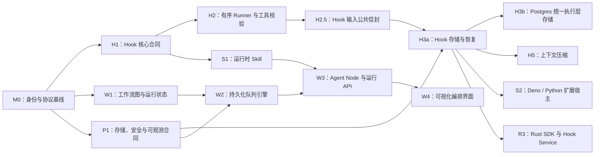

# Stratum 开发路线图

> 文档状态：讨论草案
>
> 架构总览：[`ARCH.md`](ARCH.md)

本文只记录开发节奏、依赖关系、验收条件和延后事项。总体技术架构见 [`ARCH.md`](ARCH.md)。

## 1. 执行原则

- 每个阶段先冻结依赖它的公共合同，再进入实现。
- 优先交付可运行、可持久化、可恢复的纵向切片。
- 公共协议必须覆盖兼容性、非法输入和错误脱敏测试。
- 涉及持久化的能力必须在同一阶段提供进程重启与 Resume 测试。
- 涉及代码执行、网络、文件或 Secret 的能力必须同时完成安全边界。
- 每项实现使用独立 worktree 和非 `main` 分支。
- PR 合入前，将最终实现约定归档到相关 crate 的 `AGENTS.md`。

## 2. 总体依赖

M0 完成后，Agent DIY、Workflow 和平台基础三条线可以并行。语言运行时和远程 Hook Service 必须等待 H3。

## 3. 开发节奏

| 工作线 | 主要内容 | 启动条件 |
|---|---|---|
| A：Agent DIY | Hook、Skill、脚本扩展、Rust SDK | M0 完成 |
| B：Workflow | 图模型、调度器、节点、工作流 API | M0 完成 |
| C：平台基础 | 存储、安全、可观测性、运维 | M0 期间即可启动 |

每个迭代结束时完成：

1. 运行受影响 crate 的单元、集成、异常输入和恢复测试；
2. 通过公共 API 演示一个端到端场景；
3. 检查持久化记录、事件、日志和错误是否泄露敏感信息；
4. 将已经确认的架构决策同步到对应详细设计；
5. 更新相关 crate 的 `AGENTS.md`。

## 4. M0：身份与协议基线

**目标：** 在新增公共 API 和持久化格式前统一运行身份与版本模型。

- [x] 确认 `SessionId` 表示长期、共享且与 Workflow 图无关的协作空间。
- [x] 确认 Agent 可以直接在 Session 中运行，也可以作为带类型化 location 的 Workflow 节点运行；直接对话不是隐式 Workflow。
- [x] 定义 Agent 接收 `AgentRuntimeContext`、只创建 `TurnId` 的接口。
- [x] 定义 `HookInvocationId` 的语义地址；本阶段不引入 node execution 或 attempt 身份。
- [x] 定义 Agent、Workflow、SkillSet、ExtensionSet 和 Hook Handler 的不可变版本身份。
- [x] 统一 `docs/PROTOCOL.md` 与当前 `StreamEnvelope`、三类 `RuntimeEvent`、Agent `message_seq` 和不透明 `EventCursor`。（该协议面已被 `complete-postgres-agent-runtime` 取代并删除；协议权威现为 utoipa 生成的 OpenAPI，见 `docs/runtime.md`。）
- [x] 确认 Hook journal 属于 Session/Turn 执行状态，与 `AgentStore` 对话历史和 EventBus 观察分离。（`AgentStore` 与 EventBus 已随 `complete-postgres-agent-runtime` 删除；journal 作为 durable event 变体进入 Postgres ledger。）
- [x] 完成 Skill、Script Extension、链接式 Rust Hook 和 Hook Service 的基础信任规则。

**验收条件：**

- [x] 身份、版本固定、Hook 错误和 Resume 语义形成已接受的设计记录。
- [x] Workflow 和 Hook 不依赖旧 `RunId`、`EventSource` 或顶层可选序号语义。
- [x] Beta 数据与载荷直接拒绝，不设计迁移、降级或回滚路径。

## 5. 工作线 A：Agent DIY

### H1：五个核心 Hook 合同

**依赖：** M0。

- [x] 定义 `transform_context` 输入与决策。
- [x] 定义 `transform_tool_call` 的继续与修改决策。
- [x] 定义 `decide_tool_call` 的允许与阻断决策。
- [x] 定义 `after_tool_call` 的结果替换决策。
- [x] 定义 `prepare_next_turn` 的继续、停止和注入消息决策。
- [x] 提供无处理器时保持现有行为的 No-op Runtime。
- [x] 通过 `AgentLoopBuilder` 注入单一 Hook Runtime。
- [x] 将取消和 Deadline 传入每次 Hook 调用。
- [x] 保持 Hook 决策与 `TelemetryEventSink` 观察路径分离。

**验收条件：**

- [x] No-op Runtime 下现有 Agent 测试行为不变。
- [x] 五个 Hook 均有正常、错误、超时和取消测试。
- [x] Block 不执行 Tool，并生成模型可见的类型化结果。

### H2：有序执行器、工具校验与审批

**依赖：** H1。

- [x] 在 `stratum-tools` 建立统一参数校验边界（`input_schema` JSON Schema 为权威，注册时编译缓存，schema 先行 + `Tool::validate` 语义补充）。
- [x] Hook 前校验模型生成的原始参数（kernel 在 `transform_tool_call` 前完成）。
- [x] transform 相位后重新校验最终参数（`hookify-tool-approval` 已在 kernel 编排中固化；完整 Hook Chain 后的复验随链实现自然继承）。
- [x] 固化 ExtensionSet 中的处理器顺序（`ChainHookRuntime` 构造即定序，`ExtensionSetVersionId` 随 `LoopStarted` 落盘）。
- [x] 实现顺序变换、Block 短路和 Stop 短路（`ChainHookRuntime`：transform/after 顺序线程化，decide 首个 Block 短路，prepare Stop 短路 + Inject 有序合并）。
- [x] 决策型 Hook 失败时关闭当前操作并返回类型化错误。
- [x] 将内置授权与用户审批放在最终参数校验之后（审批已 hook 化为 `decide_tool_call` 相位的普通 Handler，`ToolApproval` 边界已移除）。
- [x] 保持本阶段 Tool Call 顺序执行。

**验收条件：**

- [x] 重启前后处理器顺序一致（resume 比对 `LoopStarted` 中的链版本，不匹配 fail closed）。
- [x] 审批界面展示的参数与实际执行参数一致（由相位顺序结构性保证：decide 只接收复验后的最终参数，且 decide 不允许修改参数）。
- [x] Hook 修改后的非法参数不会进入审批或 Tool 执行（transform 结果必须过复验）。

### H2.5：Hook 输入公共信封

**依赖：** H1。**阻塞：** H3 输入摘要冻结、S1 handler 编写、S2 协议冻结（破坏性合同修订，越晚越贵）。

- [x] 定义借用公共信封 `HookSnapshot`（`iteration`、`&LoopContext`、`Option<TokenUsage>`，未来可扩展工具列表与预算），嵌入全部五个 Hook 输入。
- [x] 逐点钉死 `snapshot.context` 语义：该 Hook 边界时刻的 committed context；`transform_context` 含待消费 Inject；`after_tool_call` 不含未提交的当前 result。
- [x] 保持宽读窄写：decision 词汇不变，公共信息只读。
- [x] `after_tool_call` 经由信封获得完整历史，使结果级压缩等内容感知决策可行。
- [x] 同步 No-op、公共导出、recording 测试基建与全部 hook 测试。

**验收条件：**

- [x] 新增公共字段只改 `HookSnapshot` 一处即可被全部 Hook 点继承（以一次模拟新增字段验证）。
- [x] 信封化后所有既有 hook 行为测试保持不变。

### H3a：Hook 存储与恢复（历史 filesystem 实现已被取代，内核 resume 保留）

**依赖：** H2、P1。

- [x] 历史决策曾使用 filesystem per-run 目录；该执行后端已被
  `complete-postgres-agent-runtime` 彻底取代并删除，当前 Hook 记录只进入统一
  Postgres durable ledger（见 H3b）。
- [x] Hook 记录归 Session/Turn 执行事实，不写进 Agent 消息或 telemetry；它们经 `DurableAgentEvent` invocation 变体进入 Postgres ledger。
- [x] 固定 ExtensionSet 和 Handler 版本与顺序（H2 已覆盖：`ChainHookRuntime` 构造即定序，`ExtensionSetVersionId` 随 `LoopStarted` 落盘，resume 比对不匹配 fail closed）。
- [x] 保存每次 Hook 的 ID、输入摘要、决定和最终状态。
- [x] 调用 Handler 前先保存 Pending，应用决定前先保存 Completed。
- [x] Resume 时复用已经保存的决定；记录不匹配时停止。
- [x] 重试 Pending Hook 时复用原来的 `HookInvocationId`。
- [x] Tool 执行前保存最终参数或 Block 决定。
- [x] Tool Message 提交前保存 `after_tool_call` 结果。
- [x] 进入下一次迭代前保存 Stop/Inject 决定。

**验收条件：**

- [x] 在每个保存边界模拟崩溃后都能正确恢复。
- [x] 恢复时不会重新执行已经完成的 Hook。
- [x] Extension 更新不会改变正在运行或恢复的 Turn（链版本随 `LoopStarted` 固定，resume 只认落盘版本）。

### H3b：Postgres 统一执行层存储

**依赖：** H3a。**历史变更说明：** 原 sqlite per-session 方案因 N 库文件迁移、无跨
session 查询、server 语境并发调优和三引擎碎片被否决。后续已归档的
`add-postgres-execution-storage` 方案曾保留 filesystem 定义层与 dev/test/嵌入式执行后端；
该方案又已被当前 `complete-postgres-agent-runtime` 取代。当前不存在 filesystem
执行后端或 backend selector：Postgres 是唯一执行真相，最终为四表模型（见
`docs/runtime.md`）。

- [ ] ~~新建 `stratum-postgres`：`PostgresDurableEventSink` 与 `PostgresAgentStore`，`sqlx migrate` 管理 schema（`durable_events` / `agent_state` / `agent_messages`）。~~（已由 `complete-postgres-agent-runtime` 取代：concrete `PostgresBackend` + 内嵌 sqlx baseline，四表 `agents`/`agent_states`/`durable_events`/`transcript_compactions`，无 `agent_messages` 投影表；`agents` 是可复用template版本，`agent_states` 是长期运行聚合。）
- [ ] ~~`append_message` 单事务双写：journal 事件 + 序号分配 + 消息投影行一次提交。~~（已取代：无消息投影；集中 append 事务以 exact `agent_states` 行锁分配无空洞 AgentRuntime-wide `event_seq`。）
- [ ] ~~`stratum-store` 纯合同化；filesystem 后端迁 `stratum-infra`（独立 commit）。~~（已取代：`stratum-store` crate 与 filesystem 执行后端均已整体删除。）
- [ ] ~~组合根显式 `backend = "postgres" | "filesystem"`，无静默回退；生产默认 postgres。~~（已取代：不存在 backend selector，Postgres 是唯一执行存储。）
- [ ] ~~双后端行为对齐：同一事件序列两种后端 replay，resume 结果逐事件一致。~~（已取代：双后端与 dual-backend replay 测试已删除。）
- [ ] 评估 per-handler 粒度 journal（依赖 H2 链式 Runner 落地）。

**为后续阶段解锁的原语：** W2 持久化队列 = `FOR UPDATE SKIP LOCKED`。

### H3a 收尾修正（下个 patch 处理）

**来源：** PR #40 的 constitution-review 报告。

- [x] 补齐 §4 tracing：journal 写入、resume 重放等保留关键路径加
  `#[tracing::instrument]`，fail-closed 拒绝至少 `warn!`。当时同步处理的 filesystem
  sink append/read 路径已随执行后端整体删除。
- [x] CI 增加 `cargo audit` 与 `cargo deny check`（§6 强制项，存量缺失）。
- [x] 修正 CONSTITUTION.md 条文矛盾与空白：§2 expect 不变量豁免 vs 附录一票否决；§5 文件网关 vs §1 分层（耐久后端允许落 stratum-infra 并直接用 std::fs）；Mutex 条款区分 std 与 tokio::Mutex；metrics 强制项需先引入 facade 基础设施；journal 载荷敏感度与保留策略条款；持久层读回的 non_exhaustive 枚举 `_` 分支必须 fail-closed。
- [x] 顺带处理当时的 review suggestions：`#[from]`/`#[source]` 冗余、resume.rs
  显式列出 composition-owned 审批事实变体、`index as u64` 改 `try_from`。
  当时涉及的 `filesystem.rs`/JoinError 实现已随执行后端删除。

### H5a：上下文压缩机制（已完成）

**依赖：** H2.5、H3。

- [x] 结果级压缩：确认由 `after_tool_call::ReplaceResult` 覆盖（唯一带写回语义的 decision，压缩结果直接耐久提交）；明确原始结果从 transcript 消失的审计权衡，原始留存依赖 H3 journal 或 handler 私有通道。
- [x] `prepare_next_turn` 新增 `Compact` 意图 decision：hook 只表达“该压了”并携带摘要，写回由 kernel 代执行。
- [x] kernel 在迭代边界执行压缩：强制 tool_call/tool_result 配对完整、system prompt 保留、摘要使用 kernel 归属的归因标记（`COMPACTION_MARKER_PREFIX`），不得伪装成用户或助手消息。
- [x] 压缩后的 transcript 成为新的 durable 基线（`TranscriptCompacted` 耐久事件），resume
  从压缩基线恢复。历史 `compact.jsonl` 检查点快速路径已随
  `complete-postgres-agent-runtime` 删除；当前快速路径只由 Postgres
  `transcript_compactions` companion 的 `retained_from_event_seq` 指针承担，指针无效时
  回退内存 full replay。
- [x] 固定摘要计算的责任边界：handler 产生摘要，journal 耐久记录已完成的 decision 以闭合崩溃窗口，kernel 不引入 summarizer 组件。
- [x] `HookSnapshot` 向组合侧暴露最近一次模型响应的可选 `usage`；它不等于累计用量，也不代表已经实现生产压缩策略。

**验收条件：**

- [x] 压缩后 resume 重建的历史与压缩基线一致。
- [x] 任何压缩结果都不切断 tool_call/tool_result 配对，切割点只在迭代边界。
- [x] 崩溃于压缩提交前时恢复为未压缩基线（fail-safe），不重复执行已完成的工作。

### H5b：通用生产 Compaction 策略（未开始，独立 proposal）

**依赖：** H5a。**强制要求：** 未来 proposal 必须先逐项回答以下问题，不得以“以后可配置”代替语义设计，也不得为了接入策略扩大 kernel 职责。

- [ ] 定义普通无 Tool Turn、跨 Turn 历史与 Tool cycle 三类触发边界；明确现有 `prepare_next_turn` 只能覆盖哪些边界，其余边界应由哪个组合侧入口承担。
- [ ] 定义 usage 度量：最近一次 `input_tokens`、跨调用累计用量或对 committed context 的确定性估算三者选哪一个；同时固定 provider 不报 usage、重启和 resume 时的等价语义。
- [ ] 定义 summary 的 provider、model、最大输入/输出 budget、超时与取消边界，并明确这些身份如何被版本固定、恢复和计费。
- [ ] 定义 summary 生成失败、超时、provider 不可用、非法输出与耐久提交失败的语义：本轮继续使用未压缩上下文、重试，还是 fail closed 结束 Turn。
- [ ] 定义 cut 策略与防风暴规则：最小保留后缀、tool_call/tool_result 配对、重复压缩的滞回/冷却、每 Turn 上限、summary 膨胀与不产生有效收缩时的停止条件。
- [ ] 定义 compaction handler 的稳定版本身份与 ordered handler chain 演进；特别解决新 handler 改变 chain version 后，旧 running Turn 如何以原固定版本 resume，不得默认将其变成 `runtime_unavailable`。
- [ ] 明确 journal 与 companion 两份 summary 的不同职责：journal 保存 handler decision 以闭合 `Completed(Compact)` 到 `TranscriptCompacted` 的崩溃窗口，companion 保存 kernel 提交的 typed marker 与 retained frontier；固定两者的一致性、保留和读取语义，不得误称全局只有一份物理摘要。
- [ ] 定义敏感信息、成本与质量边界：summary provider 的数据外发范围、持久化与日志禁止项、额外 token 成本归属、摘要长度/完整性/幻觉的质量门槛及不合格时的处置。

### H5c：Compaction 产品与故障验收（未开始）

**依赖：** H5b、P4a。

- [ ] 生产者证据单独验收：从真实生产 compaction handler 的触发判定、summary 调用、journaled decision、kernel `TranscriptCompacted` 到 Postgres companion 提交全链路；直接 seed 数据库不得充当生产者证据。
- [ ] 消费者证据单独验收：使用已确认的 durable compaction fixture 分别验证 fast path、pointer-only full replay fallback、必需 companion/summary 损坏 fail closed、NATS 丢失后 PG 冷恢复、history 原文分页与 Web marker；消费者证据不反向证明生产策略已接入。
- [ ] 对 journal commit 前后、companion transaction、commit acknowledgement、后续 iteration boundary、重启/resume 分别建立单一故障的确定性场景；每个场景使用独立 fixture 和 durable oracle，不把多个窗口串成一个手工 E2E。
- [ ] 生产者与消费者证据全部通过后，再将真实 compaction 触发、崩溃恢复和 marker 交互加入当前版本 Alpha 结束条件。

### S1：第一档运行时 Skill

**依赖：** H1 的 `transform_context`、M0 的制品版本模型。

**可并行：** H2、H3。

- [ ] 定义 Skill 元数据、`SKILL.md`、可选资源和能力声明。
- [ ] 定义 `SkillId`、不可变版本或内容摘要、SkillSet 加载顺序。
- [ ] 发布时校验路径、大小、编码、重复 ID 和元数据。
- [ ] 在 Agent/Turn runtime snapshot 中固定 SkillSet。
- [ ] 为通用 Agent 提供受信任的 Skill 上下文处理器。
- [ ] Skill 只能使用已授权 Tool，不能自行扩权。
- [ ] API 和 Web 支持发布 Skill 并挂载到通用 Agent。
- [ ] 评估 `transform_context` 扩展：当前输入只有 `LoopContext`（system prompt + messages），不含工具 schema（schema 在构造 `ChatRequest` 时才注入）。若 Skill 需要按迭代动态裁剪工具列表，需让 `transform_context` 可见甚至可替换 `Vec<ToolSpec>`；只读可见则加一个 `tools: &[ToolSpec]` 借用字段即可。注意三个 Tool Hook 的 `ToolHookTarget.spec` 已携带单个工具的 schema，审批/校验路径不受影响。

**纵向切片：**

- [ ] 发布 Skill → 挂载通用 Agent → 执行 Turn → 重启 → Resume，并确认 Skill 版本不变。

### S2：第二档 Deno/Python 扩展宿主

**依赖：** H3、扩展宿主威胁模型。

- [ ] 定义一套语言无关的版本化 Hook Wire Protocol。
- [ ] 默认在 Agent 进程外运行 Extension Host。
- [ ] 加载前校验制品摘要和协议兼容性。
- [ ] 限制运行时间、内存、输出、文件和网络权限。
- [ ] 贯穿取消、Deadline、健康检查和有界并发。
- [ ] 建立语言无关的一致性测试套件。
- [ ] 按首个真实使用场景选择 Deno 或 Python 作为第一适配器。
- [ ] 第二适配器复用同一协议和测试套件。
- [ ] 区分受信任本地模式与隔离生产模式。

### R3：第三档 Rust SDK 与 Hook 服务

**依赖：** H3；公共协议已被至少一个 Script Adapter 验证。

- [ ] 定义不暴露 Agent 内部类型的公共 Rust SDK。
- [ ] 支持在应用组合根注册链接式受信任 Hook。
- [ ] 提供基于同一协议的 Hook Service Server Helper。
- [ ] 定义服务身份、版本、Endpoint、能力、作用域和健康状态。
- [ ] 在 Turn 启动时固定解析后的服务版本与 Endpoint 集合。
- [ ] 使用认证传输和租户/项目级授权。
- [ ] 提供 SDK 合同测试与参考 Hook Service。

## 6. 工作线 B：Workflow 编排

### W1：图模型、编译器与运行状态

**依赖：** M0。

- [ ] 定义版本化 `WorkflowDefinition` 与不可变 `ExecutionPlan`。
- [ ] 定义节点输入、输出、边和变量引用。
- [ ] 校验起止节点、可达性、重复 ID、缺失引用、端口兼容和非法环。
- [ ] 定义 Workflow、Node 和 Wait 状态；并发与重试出现前不定义 Attempt 身份。
- [ ] 定义变量池的类型与大小限制。
- [ ] 定义原子状态转换与持久化错误格式。
- [ ] 为图解析、校验和调度不变量添加 Property Test。

**首批节点：**

- [ ] Start
- [ ] End/Answer
- [ ] Agent
- [ ] Tool
- [ ] Condition
- [ ] 简单数据变换

### W2：持久化队列引擎

**依赖：** W1、P1。

- [ ] 从持久化依赖状态构建有界 Ready Queue。
- [ ] 使用 `JoinSet` 管理有界并发节点。
- [ ] 下游节点入队前原子提交节点输出和终态。
- [ ] 由 Workflow Coordinator 分配确定的状态与事件顺序。
- [ ] 重启后从持久化状态重建 Ready Queue。
- [ ] 实现持久化暂停、恢复和取消命令。
- [ ] 增加 Workflow/Node Deadline 与最大执行步数。
- [ ] 在幂等与 Attempt 身份明确后再加入 Retry。

**验收条件：**

- [ ] 线性图、条件分支和有界并行分支均支持重启恢复。
- [ ] 排队中和执行中的节点均可取消。
- [ ] 重复命令保持幂等。
- [ ] 损坏的 Workflow/Graph 状态 Fail Closed。

### W3：Agent 节点、事件与运行 API

**依赖：** W2、S1。

- [ ] Workflow Runtime 接收长期 `SessionId`，并固定其 `WorkflowVersionId`。
- [ ] 将 `AgentLocation::WorkflowNode` 传入 Agent Runtime。
- [ ] 将工作流变量适配为 Agent Turn 输入。
- [ ] 将 Agent 输出投影到变量池。
- [ ] 在 Session stream 中保留 Workflow version、Node、Agent、Turn、LLM 和 Tool 身份。
- [ ] 提供 Workflow 创建、发布、运行、查询、取消和恢复 API。
- [ ] 提供 Session 事件重放与 Workflow 持久化状态读取。
- [ ] 保持直接 Agent 路径独立于 Workflow 图，同时复用 Session、事件和 snapshot 合同。

**纵向切片：**

- [ ] Start → 带 Skill 的 Agent → Condition → End，覆盖 SSE、取消、重启和 Resume。

### W4：可视化编排界面

**依赖：** W1 的稳定图 Schema 与 API。

**可并行：** W2、W3。

- [ ] 使用版本化 Fixture 构建 Workflow Editor。
- [ ] 前后端同时校验连线与端口类型。
- [ ] 区分可编辑草稿与不可变发布版本。
- [ ] 展示节点运行状态和渐进式执行详情。
- [ ] 提供测试运行输入与结果视图。
- [ ] 仅在后端具备持久化语义后开放暂停、取消和恢复控制。

## 7. 工作线 C：平台基础

### P1：存储合同

- [ ] 分离 Agent 工作区、运行状态和不可变制品的逻辑接口。
- [ ] 定义生产环境跨进程 CAS 要求。
- [ ] 定义租户/项目分区与授权边界。
- [ ] 区分需要关系查询的记录与 Blob/Object 制品。
- [ ] 定义事件、历史、Hook 执行日志和制品的保留策略。
- [ ] 为不确定写入、重试和故障恢复提供注入测试。

### P2：安全与治理

- [ ] 在接入层加入认证与租户/项目身份。
- [ ] 定义作者、发布者、执行者、审批者、查看者和管理员权限。
- [ ] 以独立 PATCH 定义 credential-aware Tool 的 opaque Secret 引用、审批消费后的安全 provider 注入与 fail-closed result transform；完成前不得把此类 Tool 注册到 runtime。
- [ ] 定义制品摘要、签名和来源记录。
- [ ] 定义 Extension 能力声明与执行策略。
- [ ] 审计网络、文件、Tool、模型和 Secret 访问。
- [ ] 在工作流等待跨进程前实现持久化审批。
- [ ] 加入速率、并发、CPU、内存、时长和输出配额。

### P3：可观测性

- [ ] 固化 Session → 可选 Workflow Node → Agent Turn → LLM/Tool/Hook 的 Span 层级。
- [ ] 记录 Hook 延迟、错误、超时、Block 和日志命中指标。
- [ ] 记录队列深度、就绪等待、节点耗时、恢复和 Retry 指标。
- [ ] 记录模型用量与 Tool 结果分类，不记录敏感载荷。
- [ ] 为发布、注册、审批和高权限执行提供审计记录。

### P4：可靠性与运维

- [ ] 为 API、Scheduler 和 Extension Worker 提供健康检查。（API 已有 `/health/live` 与 `/health/ready`，见 `docs/runtime.md`；旧 EventBus/Store 已随 `complete-postgres-agent-runtime` 删除。）
- [ ] 为排队节点、运行节点和 Hook Invocation 实现优雅关闭。
- [ ] 验证定义、状态、执行日志和制品的备份恢复。
- [ ] 在首个生产持久化格式变更前建立数据迁移机制。
- [ ] 在所有持久化边界增加进程终止故障测试。
- [ ] 校验部署中的协议和 SDK 版本兼容性。

### P4a：确定性故障测试基建 PATCH

**依赖：** P1。**范围：** 只提供测试编排与证据能力，不改变生产协议、运行时真相或业务语义。

- [ ] 以独立 proposal 定义一次只注入一个故障、可重复运行、可机器判定的测试协议与 fixture 生命周期。
- [ ] 实现 scripted LLM gateway：可精确产生 text/tool/usage/error/slow/pending 序列，并在不记录 prompt 或 credential 的前提下暴露调用次数和安全边界信号。
- [ ] 实现 observable test Tool：使用隔离副作用目标，记录 CallId、调用次数与开始/完成边界，支持在副作用前后可控暂停，但不为生产 Tool 定义通用幂等语义。
- [ ] 实现 PG commit proxy：区分 transaction 未到 COMMIT、COMMIT 可能已到达但 acknowledgement 丢失、以及 commit 已确认三类窗口，支持精确切断和恢复连接。
- [ ] 实现 disposable Postgres malformed-fixture builder：只面向带明确测试标记的独立 database，以 fresh AgentRuntime 一次构造一种 missing/malformed companion、非法 retained pointer、unsupported event version/payload、foreign identity 或 high-water/ledger inconsistency；每例保存安全只读 oracle 后重建 database，禁止连接共享/生产地址，也禁止把该入口编进 production binary。
- [ ] 实现 NATS fault/retention fixture：覆盖不可用、慢 publish、publish loss、有界队列压力、retention eviction、cursor expiry 与 stream generation 重建，且每次使用独立 stream。
- [ ] 实现 process controller：只操作精确 PID/容器身份，支持启动、等待安全边界、暂停、终止、SIGTERM 和使用同一 PG/NATS 重启，不使用宽泛进程匹配。
- [ ] 实现统一证据采集：只记录安全 identity、event type/version/sequence、state high-water、HTTP status/error code、cursor 行为和用户可见结果；输出可对比、可关联 CI，禁止 payload、prompt、Tool arguments/result、summary、provider body 与 secret。
- [ ] 所有精确暂停与故障开关必须留在 test binary、proxy 或容器 fixture 中；禁止向 production binary 加入 failpoint、debug endpoint、绕过安全边界的管理入口或第二套状态/真相源。

## 8. 并行与串行关系

### 可以并行

- H1 与 W1：M0 完成后分别推进。
- S1 与 H2/H3：`transform_context` 合同冻结后推进。
- P1/P2 与 Hook、Workflow 合同设计同步推进。
- W4 与 W2/W3：图 Schema 冻结后使用 Fixture 开发。
- Deno 与 Python Adapter：共享协议和一致性测试冻结后并行。
- 各工作线的可观测性：身份和 Span 命名冻结后同步接入。

### 必须串行

- Tool 参数修改 → 最终校验 → 用户审批 → Tool 执行。
- Hook 输入公共信封（H2.5）冻结后，才能冻结 H3 输入摘要与 S2 Hook Wire Protocol。
- Hook 存储和版本固定完成后，才能接入 Script/Rust 远程执行。
- 上下文压缩只能在迭代边界切割，禁止在 tool cycle 中间改写历史。
- Session 与版本身份基线确定后，才能固化 Workflow 持久化协议。
- 节点状态可持久化后，才能实现 Queue Resume。
- 出现真实并发/重试需求并明确从属操作幂等语义后，才能加入 Loop 与 Retry 身份。
- 隔离和能力模型通过评审后，才能执行不受信任的 Script Extension。

## 9. 延后事项

### 由 `complete-postgres-agent-runtime` 明确延期（本 change 不实现）

以下能力已确认需要，但**明确延期**，不属于 Postgres 执行真相切换的范围，届时以独立 change 提出：

- **调度与多实例（scheduler PATCH）**：durable scheduling、ownership lease/fencing、多实例 ownership/hosting、rolling deployment、自动 takeover/resume、durable cancel、Agent/Workflow Session 协调。未来的 scheduler change 必须用 ownership/placement 替换 `resume_required` 的 process-local 判定来源，同时保留该 API 字段。
- **Agent template 管理（独立 change）**：catalog CRUD、显式版本浏览、发布/提升/回滚、`GET /v1/agents` / `GET /v1/agents/{agent_id}` 与既有 AgentRuntime upgrade。当前 change 已负责在 create 时按作者 `(name, version string tag)` 自动物化/复用 immutable `agents` row；未来管理模块不得重新定义该版本身份。

### 其他延后事项

- Rust 动态共享库加载；
- 运行中的 Skill 或 Extension 热替换；
- Extension Marketplace 与自动远程安装；
- Command、Renderer、Shortcut 和任意 UI Plugin Registry；
- 并发 Tool 执行；
- 运行期间动态修改共享 Tool Registry；
- 模型主动安装 Skill；
- W2 验证前的 Loop、Iteration 和 Subgraph；
- 多地域 Workflow 迁移；
- 未出现真实调用方前的通用远程文件系统和挂载路由。
